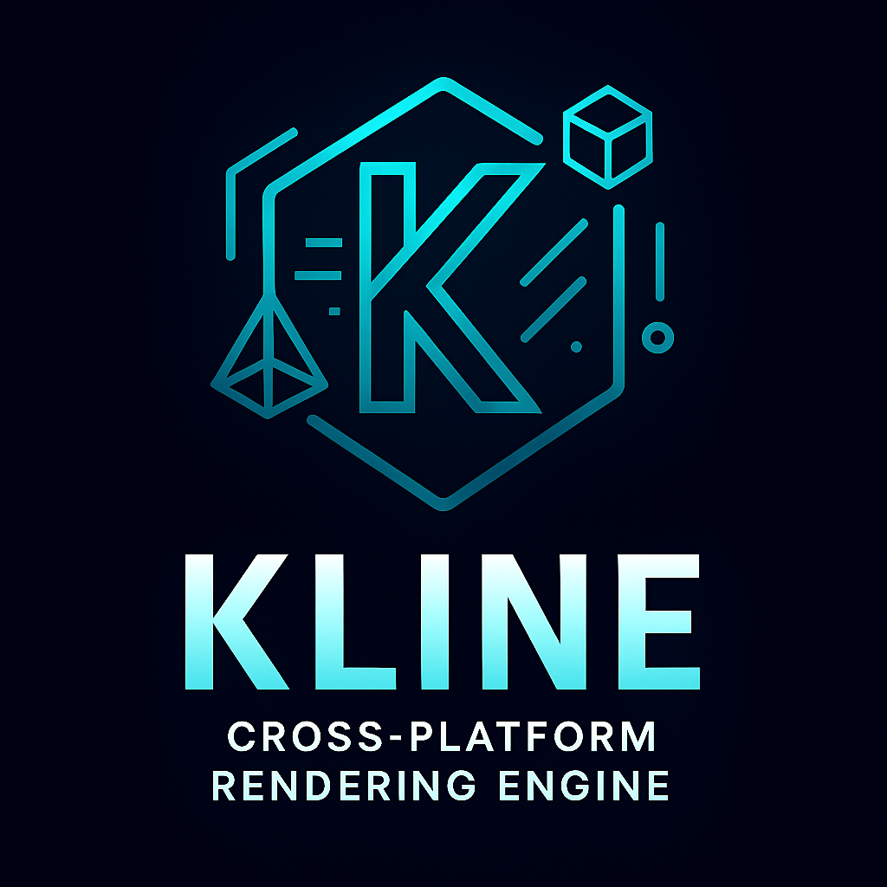

<div align="center">
  

  # Kline: Cross-Platform Rendering Engine

  <!-- Version and Language Badges -->
  
  
  

  <!-- Backend Support Badges -->
  
  
  
  
  

  <!-- Platform Support Badges -->
  
  
  
  
  

  <!-- Features Badges -->
  
  
  
  

</div>

## DISCLAIMER

⚠️ **EXPERIMENTAL LIBRARY - FOR LAB/PERSONAL USE** ⚠️

This is an experimental library under active development. It is
intended for research, learning, and personal projects. The API is subject
to change!

---

Kline is a powerful cross-platform rendering engine built in Zig, providing hardware-accelerated 3D/4D rendering with multiple backends and comprehensive graphics capabilities.

## Features

### 🎨 Multi-Backend Rendering Support
- **Vulkan 1.3** - Modern high-performance graphics API (Linux, Windows, Android)
- **DirectX 12** - Microsoft's modern graphics API (Windows 10/11)
- **DirectX 13** - Next-generation Microsoft graphics API (future-ready stubs)
- **Metal 3.0** - Apple's high-performance graphics API (macOS, iOS)
- **OpenGL ES 3.0** - Cross-platform embedded graphics (mobile, web, embedded)
- **Software Renderer** - CPU-based fallback for maximum compatibility

### 🚀 Core Capabilities
- **Hardware-accelerated 3D/4D rendering** with GPU memory management
- **Vector graphics** with paths, gradients, and transformations
- **Modern rendering pipeline** with vertex/fragment/compute shaders
- **Advanced memory pool management** for efficient resource allocation
- **GPU compute shader support** for parallel processing
- **Zero-copy operations** for optimal performance

### 💾 Memory Management
- **GPU Memory Pools** - Efficient GPU resource management
- **Ring Buffers** - Circular memory allocation for streaming data
- **Buddy Allocators** - Advanced memory allocation algorithms
- **Custom allocators** optimized for graphics workloads

### ⚡ Compute & Parallel Processing
- **Parallel operations** (map, reduce, scan)
- **Image processing** kernels (blur, convolution, edge detection)
- **Physics simulation** support (particles, cloth, fluid)
- **Machine learning** primitives (matrix operations, convolutions)

### 🎯 Advanced Graphics Features
- **4D Graphics Support** - Extended dimensional rendering capabilities
- **Compute Shaders** - GPU-accelerated parallel computing
- **Pipeline State Objects** - Modern graphics state management
- **Multi-pass Rendering** - Complex rendering techniques
- **Resource Binding** - Efficient GPU resource management
- **Cross-API Compatibility** - Write once, render everywhere

## Getting Started

### Prerequisites
- Zig 0.16.0 or later
- Platform-specific graphics libraries (optional for software rendering)

### Adding to Zig Project
```bash
# Add Kline to your Zig project
zig fetch --save https://github.com/ghostkellz/kline/archive/refs/heads/main.tar.gz
```

### Building
```bash
# Build the library
zig build

# Run tests
zig build test

# Build and run the triangle example
zig build triangle
```

### Basic Usage

```zig
const std = @import("std");
const kline = @import("kline");

pub fn main() !void {
    var gpa = std.heap.GeneralPurposeAllocator(.{}){};
    defer _ = gpa.deinit();
    const allocator = gpa.allocator();

    // Create a renderer (software backend for maximum compatibility)
    var renderer = try kline.createRenderer(allocator, .software);
    defer {
        renderer.deinit();
        allocator.destroy(renderer);
    }

    // Create vector graphics context
    var vector_ctx = try kline.VectorContext.init(allocator, renderer);
    defer vector_ctx.deinit();

    // Draw a red rectangle
    vector_ctx.setFillColor(kline.vector.Color.red);
    try vector_ctx.fillRect(50, 50, 200, 100);

    // Present the frame
    try renderer.present();
}
```

## Architecture

### Renderer Abstraction
The core `Renderer` interface provides a unified API across all graphics backends:
- Buffer management (vertex, index, uniform)
- Texture creation and management
- Pipeline state objects
- Render pass management

### Vector Graphics
Comprehensive 2D vector graphics system:
- Path construction with moves, lines, curves, and arcs
- Fill and stroke operations
- Gradients and patterns
- Transform matrices and clipping

### Memory Management
Multiple allocation strategies optimized for graphics:
- Fixed-size pools for frequent allocations
- Ring buffers for streaming data
- Buddy allocators for variable-sized blocks
- GPU memory pools with automatic defragmentation

## Examples

The `examples/` directory contains demonstration code:
- `triangle.zig` - Basic rendering setup with vertex buffers and shaders

## Testing

Run the test suite to verify functionality:
```bash
zig build test
```

Tests cover:
- Renderer creation and basic operations
- Vector graphics path construction
- Memory pool allocation and deallocation
- Cross-platform compatibility

## Project Structure

```
src/
├── renderer.zig        # Core renderer abstraction
├── vector.zig          # Vector graphics system
├── memory_pool.zig     # Memory management
├── compute.zig         # Compute shader support
├── vulkan/             # Vulkan backend
├── dx12/               # DirectX 12 backend
├── dx13/               # DirectX 13 stubs
├── metal/              # Metal backend
├── gles/               # OpenGL ES backend
└── software/           # Software renderer
```

## Platform & Backend Support Matrix

| Platform | Vulkan 1.3 | DirectX 12 | DirectX 13 | Metal 3.0 | OpenGL ES 3.0 | Software |
|----------|------------|-------------|-------------|-----------|---------------|----------|
| **Windows 10/11** | 🟢 Ready | 🟢 Ready | 🟡 Stubs | ❌ N/A | 🟢 Ready | 🟢 Ready |
| **Linux** | 🟢 Ready | ❌ N/A | ❌ N/A | ❌ N/A | 🟢 Ready | 🟢 Ready |
| **macOS** | ❌ Deprecated | ❌ N/A | ❌ N/A | 🟢 Ready | 🟢 Ready | 🟢 Ready |
| **iOS** | ❌ N/A | ❌ N/A | ❌ N/A | 🟢 Ready | 🟢 Ready | 🟢 Ready |
| **Android** | 🟢 Ready | ❌ N/A | ❌ N/A | ❌ N/A | 🟢 Ready | 🟢 Ready |
| **Web/WASM** | ❌ Limited | ❌ N/A | ❌ N/A | ❌ N/A | 🟢 Ready | 🟢 Ready |

**Legend:** 🟢 Implemented | 🟡 Partial/Stubs | ❌ Not Available

## License

This project is available under the MIT License. See LICENSE file for details.

## Contributing

Contributions are welcome! Please feel free to submit pull requests or open issues.

## Roadmap

- [ ] Complete Vulkan backend implementation
- [ ] DirectX 12 refinements and optimization
- [ ] Metal backend completion
- [ ] OpenGL ES backend optimization
- [ ] Text rendering support
- [ ] Advanced shader compilation
- [ ] Multi-threading support
- [ ] WebGPU backend
- [ ] Documentation and tutorials
